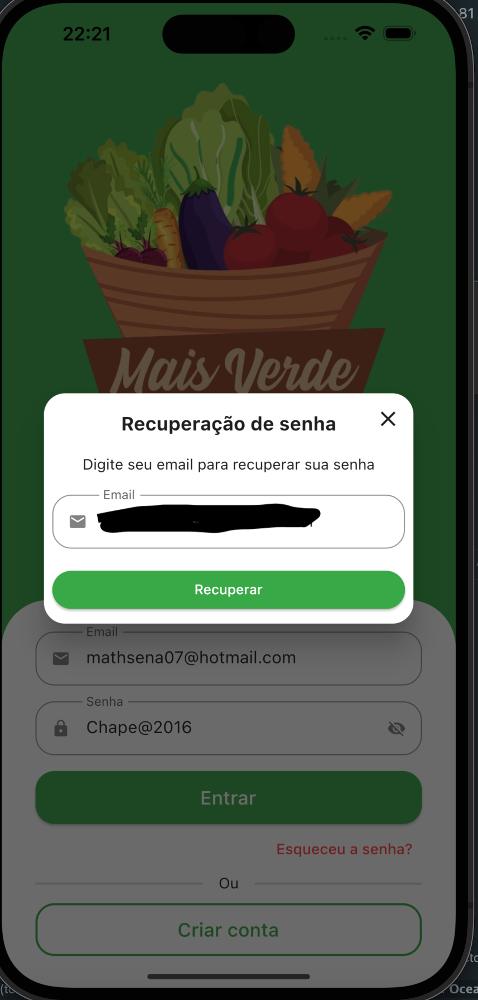
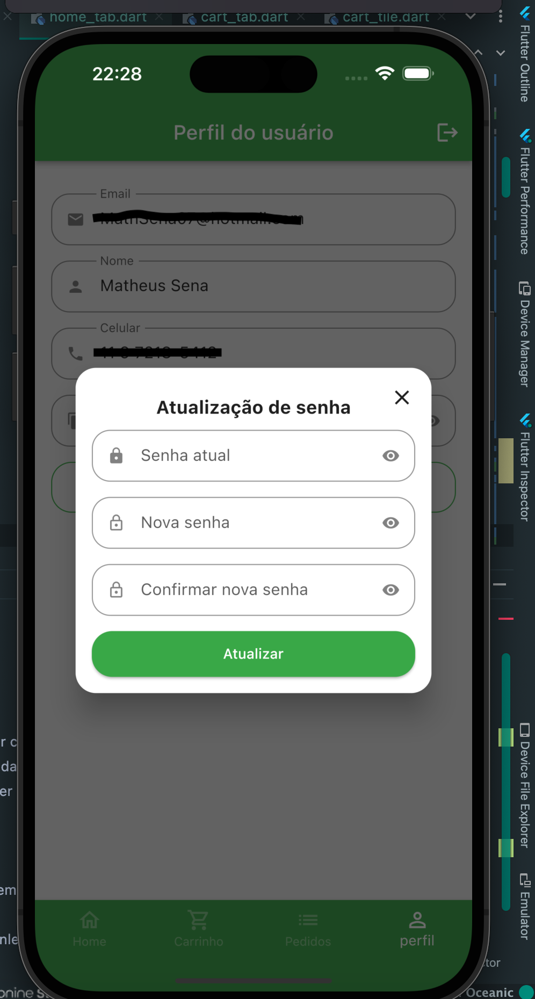

# mais_verde APP

Aplicativo **Mobile Flutter** desenvolvido para a disciplina de
**Mobile Development** no MBA da **FIAP** (43SCJ).

Este aplicativo foi uma ideia de criação para um hortifruti da cidade de Embu das Artes, chamado [**Mais Verde**](https://www.instagram.com/maisverde_hortifruti/)

## Integrantes do Grupo

- RM 344702 - <a target="_blank" rel="noopener" href="https://www.linkedin.com/in/mathsena07/">Matheus Sena</a>
- RM 344536 - <a target="_blank" rel="noopener" href="https://www.linkedin.com/in/lucca-braz-a31755b5">Lucca Braz</a>
- RM 344433 - <a target="_blank" rel="noopener" href="https://www.linkedin.com/in/vinicius-roxo-brand%C3%A3o-19ba1115a/">Vinicius Roxo</a>

## Configurando o aplicativo

- Realize o clone do
[repositório do aplicativo](https://github.com/VictorAlvesBug/app-controle-financeiro)
executando o seguinte comando no **cmd**, dentro da pasta desejada:

```bach
git clone https://github.com/MathSena/mais_verde.git
```

No **Android Studio**, abra o projeto:

Abra o **cmd** ou o **terminal** da IDE na pasta do projeto e execute os
seguintes comandos para **atualizar o Flutter** e carregar as
**dependências do projeto**:

```bash
flutter upgrade
flutter pub get
```

Na barra superior do **Android Studio**, selecione o dispositivo que deseja
utilizar e depois clique no ícone **Run**, com o arquivo **main.dart**
selecionado.

**Obs.**: API utilizada é uma API criada na **back4app** [https://www.back4app.com/]

## Telas principais

Inicialmente é exibida uma **Splash Screen**.
Após isso, ele pode **criar uma conta** ou **entrar** com uma conta já existente:

 

Caso necessário, é possível solicitar uma ***recuperação de senha*** para o e-mail cadastrado:




Após isso, é exibida uma página com os ***itens disponíveis para compra***, separados por categoria de produto.
Ao clicar no ícone do carrinho, em cima do produto, é adicionado o item ao carrinho:


No Carrinho de compras, é possível adicionar mais itens e após clicar em concluir pedido, é exibido um QR Code para ***pagamento via PIX:***

 


Em pedidos, é exibida uma ***lista com os pedidos*** feitos pelo usuário, na qual é possível verificar o status dos pedidos e solicitar novamente o QR Code PIX:


  
Ao clicar em perfil, além de ser exibida as ***informações do usuário***, é possível ***alterar a senha do usuário:***

 

OBS.: Valores, preços e descrição dos produtos não refletem a realidade


## Getting Started

This project is a starting point for a Flutter application.

A few resources to get you started if this is your first Flutter project:

- [Lab: Write your first Flutter app](https://docs.flutter.dev/get-started/codelab)
- [Cookbook: Useful Flutter samples](https://docs.flutter.dev/cookbook)

For help getting started with Flutter development, view the
[online documentation](https://docs.flutter.dev/), which offers tutorials,
samples, guidance on mobile development, and a full API reference.